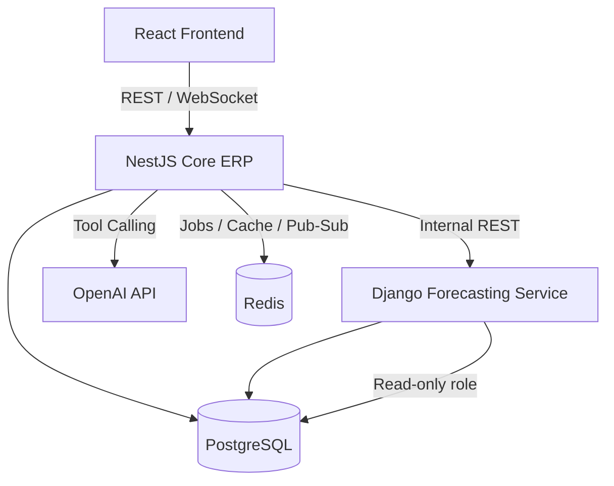

<p align="center">
  
</p>

<div align="center">

# LoomStack

**A polyglot, multi-tenant ERP for modern manufacturers**

Recursive BOM costing · ML-driven demand forecasting · Real-time distributed inventory · AI copilot

[](https://nestjs.com/)
[](https://www.djangoproject.com/)
[](https://react.dev/)
[](https://www.postgresql.org/)
[](https://www.typescriptlang.org/)
[](https://www.python.org/)
[](https://redis.io/)
[](https://www.docker.com/)
[](https://openai.com/)

[](LICENSE)
[](CONTRIBUTING.md)
[](../../actions)

</div>

---

## Overview

LoomStack is a multi-tenant ERP system built for small-to-mid manufacturers running production across multiple factories and warehouses. Rather than a single monolithic codebase, LoomStack is built as a **polyglot architecture** — the right language and framework for each domain:

- **NestJS (TypeScript)** powers the core ERP: inventory, multi-level BOM costing, MRP orchestration, finance, and configurable approval workflows.
- **Django (Python)** runs a dedicated forecasting service using Prophet and statsmodels, feeding demand predictions directly into the MRP engine.
- **PostgreSQL** backs both services, using recursive CTEs for BOM explosion and row-level security for tenant isolation.
- **React** delivers real-time shop-floor dashboards over WebSockets.
- **OpenAI** powers a natural language copilot that lets users query inventory, forecasts, and production status conversationally — via tool calling against the real ERP API, never against raw SQL.

---

## Core Capabilities

| Module | Description |
|---|---|
| **Multi-tenancy** | Row-level security in PostgreSQL, tenant-aware caching and job queues |
| **Bill of Materials** | Multi-level BOMs with recursive cost rollup and versioned engineering change orders |
| **MRP Engine** | Demand-driven material requirements planning with lead-time-aware, backward/forward scheduling |
| **Inventory** | Distributed multi-warehouse stock with reservation locking to prevent overselling |
| **Finance** | Auto-generated double-entry ledger transactions for every inventory and production event |
| **Approvals** | Configurable, rules-based approval chains for purchase orders and expenses |
| **Forecasting** | ML-based demand forecasting (Prophet / statsmodels) feeding the MRP engine |
| **AI Copilot** | Conversational querying of inventory, forecasts, and production status via OpenAI function calling |
| **Dashboards** | Real-time shop-floor visibility via WebSockets |

---

## Architecture



**Design principles:**
- The forecasting service has **read-only** database access — it returns predictions, and NestJS validates and persists them. It never writes to core ERP tables.
- The AI copilot never queries the database directly. It calls a fixed set of permission-checked tools exposed by the NestJS API, and the result is summarized back to the user.
- MRP and forecasting jobs run asynchronously via Redis-backed queues — never synchronously inside a request.

---

## Tech Stack

**Backend (Core ERP)**
- NestJS · TypeScript · Prisma · PostgreSQL · Redis · BullMQ · Socket.IO

**Forecasting Service**
- Django · Django REST Framework · Prophet · statsmodels · pandas · Celery

**Frontend**
- React · TypeScript · TanStack Query · Zustand · Recharts · Tailwind CSS · shadcn/ui

**AI**
- OpenAI API (function calling / tool use)

**Infrastructure**
- Docker · Docker Compose · GitHub Actions (CI)

---

## Getting Started

### Prerequisites
- Docker and Docker Compose
- Node.js 20+
- Python 3.11+
- An OpenAI API key

### Setup

```bash
git clone https://github.com/your-org/loomstack-erp.git
cd loomstack-erp
cp .env.example .env
docker compose up --build
```

This spins up:
- `api` — NestJS core ERP (port 3000)
- `forecasting` — Django forecasting service (port 8000)
- `frontend` — React app (port 5173)
- `postgres` — PostgreSQL database
- `redis` — Redis (cache, queues, pub/sub)

### Environment variables

| Variable | Description |
|---|---|
| `DATABASE_URL` | PostgreSQL connection string |
| `REDIS_URL` | Redis connection string |
| `OPENAI_API_KEY` | OpenAI API key for the AI copilot |
| `JWT_SECRET` | Secret for auth token signing |
| `FORECASTING_SERVICE_URL` | Internal URL for the Django forecasting service |

---

## Project Structure

```
loomstack-erp/
├── apps/
│   ├── api/            # NestJS core ERP
│   ├── forecasting/    # Django forecasting service
│   └── frontend/       # React application
├── packages/
│   └── shared-types/   # Shared TypeScript types/interfaces
├── docker-compose.yml
└── README.md
```

---

## Roadmap

- [ ] Multi-currency ledger support
- [ ] Predictive maintenance module (machine usage → maintenance forecasting)
- [ ] Anomaly detection on inventory and production timing
- [ ] Kubernetes deployment manifests for multi-tenant scaling

---

## Contributing

Contributions are welcome. Please open an issue to discuss significant changes before submitting a pull request.

## License

Released under the [MIT License](LICENSE).

<div align="center">

Built with NestJS, Django, React, and PostgreSQL.

</div>